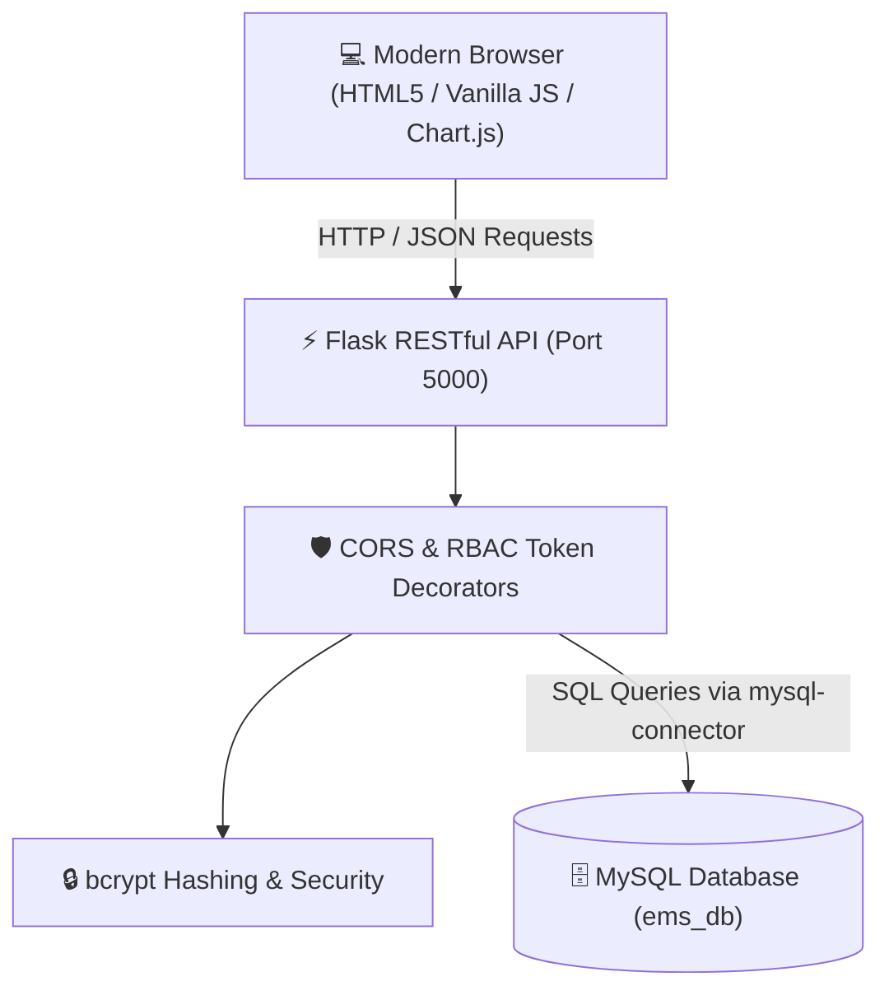

# 🏢 Employee Management System (EMS)

[](https://www.python.org/)
[](https://flask.palletsprojects.com/)
[](https://www.mysql.com/)
[](https://developer.mozilla.org/)
[](LICENSE)

> A modern, full-stack Enterprise Employee Management System featuring a high-performance **Python Flask REST API**, robust **MySQL relational database**, and a stunning **glassmorphic dark-mode dashboard** with Role-Based Access Control (RBAC), analytics, time tracking, and leave management.

---

## 📸 Overview & Architecture

EMS is designed to streamline corporate workforce administration. It offers real-time payroll and employee analytics, automated time logs (clock-in/clock-out), dynamic leave approval workflows, and granular permission enforcement across three tier roles: **Admin**, **Manager**, and **Employee**.



---

## ✨ Key Features

- 🎨 **Glassmorphic UI / UX Design**
  - Crafted with custom Google Fonts (*Outfit* & *Plus Jakarta Sans*), micro-interactions, smooth CSS animations, and custom scrollbars.
  - Interactive toast notifications for real-time operation feedback.
- 📊 **Real-Time Analytics Dashboard**
  - Total active workforce counts, average salary metrics, department breakdown pie/bar charts powered by **Chart.js**.
- 👥 **Comprehensive Employee CRUD**
  - Full employee record creation, inline updating, and deletion (restricted to Admin role).
  - Search and filter employees dynamically by department or role.
- ⏱️ **Attendance & Time Tracking**
  - Live clock-in / clock-out toggles for employees with automatic shift duration calculation (hours).
  - Centralized time logging system for managerial audits.
- 📅 **Leave Request & Approval System**
  - Employees can submit time-off requests with date range and rationale.
  - Admins and Managers can review, approve, or reject pending leave applications.
- 🔐 **Role-Based Access Control (RBAC)**
  - Granular server-side protection using custom Flask decorators (`@token_required`, `@admin_required`, `@admin_or_manager_required`).
  - Hashed password verification using `bcrypt`.

---

## 🛡️ Access Control & User Roles

| Role | Access Permissions | Primary Capabilities |
| :--- | :--- | :--- |
| **Admin** | 👑 Full System Access | Analytics, Employee CRUD, Leave Approval, View All Logs |
| **Manager** | 💼 Supervisory Access | Analytics, Leave Approval, View All Logs |
| **Employee** | 👤 Self-Service Access | Personal Profile, Clock In/Out, Submit Leave Requests |

---

## 📁 Repository Structure

```
EMS/
├── app.py                         # Python Flask RESTful API server & RBAC middleware
├── db.sql                         # MySQL Database schema & initial seed data
├── employee_management_app.html   # Main Dashboard SPA UI layout & styles
├── script.js                      # Frontend API client, DOM controller & Chart.js logic
├── test_api.py                    # Automated API integration test suite
├── .gitignore                     # Git ignore rules for virtual environment & cache
└── README.md                      # Comprehensive project documentation
```

---

## 🛠️ Tech Stack

- **Backend**: Python 3.x, Flask, `mysql-connector-python`, `bcrypt`
- **Database**: MySQL 8.0+
- **Frontend**: Single Page Application (HTML5, Vanilla CSS3, JavaScript ES6+)
- **Visualization**: Chart.js
- **Testing**: Python integration test suite (`test_api.py`)

---

## ⚡ Quickstart & Local Setup

### 1. Database Initialization
Ensure your local MySQL server is running, then execute `db.sql` to build the database schema and seed default records:

```bash
mysql -u root -p < db.sql
```

*(This creates the `ems_db` schema with `users`, `employees`, `leave_requests`, and `time_logs` tables).*

### 2. Python Virtual Environment Setup
Create and activate a Python virtual environment:

```bash
# Windows PowerShell
python -m venv venv
.\venv\Scripts\Activate.ps1

# Linux / macOS
python3 -m venv venv
source venv/bin/activate
```

Install the required dependencies:
```bash
pip install Flask mysql-connector-python bcrypt requests
```

### 3. Database Configuration
Open `app.py` and update the `DB_CONFIG` dictionary to match your MySQL connection credentials:

```python
DB_CONFIG = {
    'host': 'localhost',
    'user': 'root',        # Your MySQL username
    'password': 'your_password', # Your MySQL password
    'database': 'ems_db'
}
```

### 4. Running the Backend REST API
Launch the Flask development server:

```bash
python app.py
```
*The server will start on `http://127.0.0.1:5000/` with automatic CORS handling enabled.*

### 5. Launching the Frontend
Open `employee_management_app.html` directly in any standard web browser (or serve it using VS Code Live Server).

---

## 🔑 Demo Test Credentials

| Username | Password | Role | Linked Employee ID |
| :--- | :--- | :--- | :--- |
| `admin` | `adminpassword` | **Admin** | *N/A (System Administrator)* |
| `manager` | `managerpassword` | **Manager** | *N/A (Supervisory Manager)* |
| `alice` | `anypass` | **Employee** | `E1001` |

---

## 📡 API Endpoints Reference

| Endpoint | Method | Role Required | Description |
| :--- | :--- | :--- | :--- |
| `/api/login` | `POST` | Public | Authenticate user & receive session token |
| `/api/employees` | `GET` | Authenticated | Fetch all employee records |
| `/api/employees` | `POST` | `Admin` | Add new employee record |
| `/api/employees/<id>` | `PUT` | `Admin` | Update existing employee profile |
| `/api/employees/<id>` | `DELETE` | `Admin` | Delete employee record |
| `/api/leaves` | `GET` | Authenticated | Get leave requests (Employee's own or All) |
| `/api/leaves` | `POST` | `Employee` | Submit a new leave request |
| `/api/leaves/<id>` | `PUT` | `Admin` / `Manager` | Approve or reject leave request |
| `/api/time/status` | `GET` | `Employee` | Check active clock-in status |
| `/api/time/clock` | `POST` | `Employee` | Clock in or clock out |
| `/api/time/logs` | `GET` | Authenticated | Retrieve time & attendance logs |

---

## 🧪 Integration Testing

Execute the automated backend API test suite to verify database connection, token authentication, CRUD operations, and time logging:

```bash
python test_api.py
```

---

## 📄 License

This project is open-source and available under the [MIT License](LICENSE).
